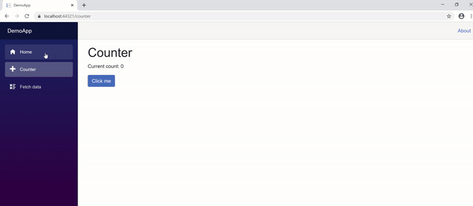

# Bootstrap-Paging-For-Blazor

This package is for displaying the pager for paged data received from your API or data store

# Instalation

1. <b>Install the package</b>

> dotnet add package BlazorBootstrapPaging
>
> OR
>
> PM> Install-Package BlazorBootstrapPaging

2. <b>Import Component</b>

> Add the following using statement @using BootstrapPaging to one of the
> following:
>
> - For global import add it to your \_Imports.razor file
> - For a scoped import add it to your desired Blazor component

# Usage

1. Take a look at sample usage in the link below
   > https://github.com/oteebest/Bootstrap-Paging-For-Blazor/blob/main/BootstrapPaging/DemoApp/Pages/Index.razor
